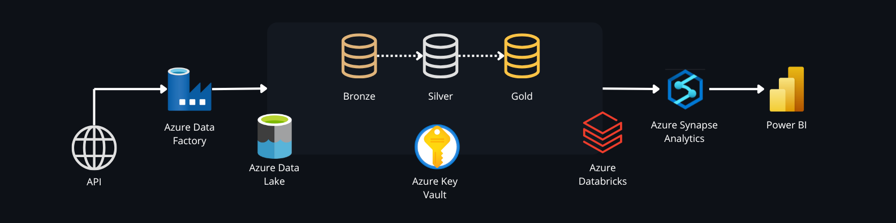
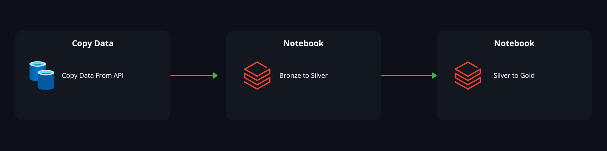

# End-to-end Data Engineering in Azure

## 1. Project Overview

This project showcases an end-to-end data engineering pipeline, leveraging Azure services for efficient ingestion, transformation, and analysis of brewery data sourced from an external API. The pipeline adheres to the medallion architecture (bronze, silver, gold layers) to maintain data integrity, optimize storage, and support scalable analytics.

## 2. Objective
The objective is to build a robust data pipeline capable of:

- Consuming data from the Open Brewery DB API.
- Storing and transforming data according to the medallion architecture.
- Creating an analytical layer to derive insights, such as the number of breweries by type and location.

## 3. Project Architecture

### 3.1 Key Components



- **API**: External data source that has an endpoint (<https://api.openbrewerydb.org/breweries>) for listing breweries in json format.
- **Azure Data Factory (ADF)**: Responsible for orchestrating the data pipeline, managing workflows, and integrating various services.
- **Azure Storage Account**: Stores data in bronze (raw), silver (curated), and gold (aggregated) layers with Azure Data Lake Storage Gen2 (ADLS Gen2).
- **Azure Key Vault**: Manages secrets and credentials, ensuring secure connections to services, in this project used for Azure Databricks Token.
- **Azure Databricks**: Used for batch processing and data transformation, leveraging **Apache Spark** for scalability and distributed processing.
- **Azure Synapse Analytics**: Acts as a data repository for SQL queries and advanced analysis.
- **Power BI**: Data visualization tool for reports and dashboards.

### 3.2 Data Flow
1. **Data Ingestion**: Data is extracted from external sources using **ADF** and stored in the bronze layer (parquet format).
2. **Data Transformation**: **Databricks** processes data from the bronze layer, performs cleaning, normalization, and saves it in the silver layer in **Parquet** format, partitioned by location.
3. **Aggregation and Analysis**: High-level views are created in the gold layer with metrics such as the number of breweries by type and location.
4. **Load to Synapse Analytics**: Data is loaded into **Synapse** for SQL queries and **Power BI** integration.

## 4. Service Configuration

Use an Azure Account, Subscription and a Resorce group with the following resources: Azure Data Factory, Azure Storage Account, Azure Databricks, Azure Key Vault, Azure Synapse Analytics.

### 4.1 Azure Storage Account

- The Azure Storage Account is must be organized into containers that represent different layers of the data pipeline:

  - **Bronze**: Raw data.
  
  - **Silver**: Processed data.
  
  - **Gold**: Ready-for-analysis data.
  
  - **Synapse**: Data necessary for **Azure Synapse Analytics** queries and **Power BI** integration.


### 4.2 Azure Data Factory



Follow these detailed instructions to set up **Azure Data Factory (ADF)** effectively:

#### 4.2.1 Pipeline Setup
- **Pipeline**:
  - Create a pipeline with the following activities:
    - **Copy Data Activity**: Configured to extract data from the API and load it into the bronze layer of the **Data Lake**.
      - **Source dataset**: Use a linked service dataset with the request method set to **GET**.
      - **Sink dataset**: A linked service dataset that writes data to **Azure Data Lake Storage Gen2** bronze layer.
    - **Notebook Activity**: Add two **Notebook Activities** to the pipeline, each configured to use the **Databricks linked service**. 
      - **First Notebook Activity**: Transforms data from the **bronze** layer to the **silver** layer. Specify the path to the notebook that performs data cleaning and partitioning.
      - **Second Notebook Activity**: Processes data from the **silver** layer to the **gold** layer. Specify the path to the notebook that aggregates and prepares the data for analysis.


#### 4.2.2 Linked Services Setup
Configure the following **Linked Services** in ADF:

1. **HTTP**:
   - **Base URL**: Set the API endpoint (e.g., `https://api.openbrewerydb.org/breweries`).
   - **Authentication Type**: Choose **Anonymous**.

2. **Azure Data Lake Storage Gen2**:
   - **ADLS Gen2 URL**: Use the URL of your storage account (e.g., `https://<storage-account-name>.dfs.core.windows.net`).
   - **Storage Account Key**: Enter the access key for the storage account.

3. **Azure Key Vault**:
   - **Base URL**: Configure with the Key Vault URL (e.g., `https://<keyvault-name>.vault.azure.net`).
   - **Secure Access**: Ensure that required credentials, such as Databricks tokens, are stored in the Key Vault.

4. **Azure Databricks**:
   - **Authentication**: Use **Azure Key Vault** for secure management of credentials.
   - **Existing Cluster ID**: Set the Linked Service with the ID of an existing Databricks cluster to execute the notebooks.

#### 4.2.3 Access Control (IAM)
To ensure proper and secure access, assign the following roles:

- **Owner**:
  - Grants full access to manage all **Azure Data Factory** resources, including the ability to assign roles in **RBAC** (Role-Based Access Control).

- **Key Vault Administrator**:
  - Allows all data plane operations on **Key Vault**, including managing certificates, keys, and secrets. **Note**: Does not permit managing Key Vault resources or role assignments.

- **Storage Blob Data Contributor**:
  - Provides read, write, and delete access to data within **Azure Storage** blob containers. This is essential for data ingestion and transformation activities that require file manipulation.

### 4.3 Azure Databricks

- **Cluster Configuration**:
  - The cluster is set up with a **single node** configuration for simplicity and efficient resource usage.
  - Configured with the **latest LTS (Long-Term Support) Databricks Runtime Version** to ensure stability and access to updated features.
  - Uses the **Standard_D4pds_v6** node type, which adheres to the **core limits of the Azure subscription**.
  - **Azure Data Lake Storage (ADLS) Credential Passthrough** is enabled, allowing seamless and secure access to data stored in ADLS without manual credential management.

- **Notebooks**:
  - The repository includes notebooks that must be **uploaded to Databricks** to run the data transformation tasks.
  - These notebooks handle essential data transformations, including location-based partitioning and the processing required for the bronze, silver, and gold data layers.


### 4.4 Azure Key Vault
- Use to securely store **access token** that can be used for authentication to the Databricks API instead of passwords.

### 4.5 Azure Synapse Analytics

- **Serverless SQL Database**:
  - Create a **Serverless SQL pool** in Azure Synapse Analytics for efficient querying of data stored in **Azure Data Lake** without the need for provisioning dedicated resources.

- **SQL View**:
  - Create a **View** inside the serverless SQL database to access data from the **gold layer** in **Azure Data Lake Storage Gen2**. 
  - The following SQL script defines the view for querying **Parquet**-formatted data stored in the **gold** folder:

    ```sql
    CREATE OR ALTER VIEW CreateSQLServerlessViewGold AS
    SELECT
         *
    FROM
         OPENROWSET(
               BULK 'https://<storage-account-name>.dfs.core.windows.net/<storage-account-path>',
               FORMAT = 'PARQUET'
         ) AS [result];
    ```

  - The created view aggregates data from the **gold layer** for **Power BI** integration, enabling seamless reporting and visualization.

### 4.6 Power BI

- **Dashboard Publication**:
  - To publish the Power BI dashboard included in the repository, you must use a **Microsoft corporate account**.
  
  - The dashboard is stored in the **.pbip** file within this repository. After opening the file in Power BI Desktop, use your corporate Microsoft account to publish the report to the Power BI service for sharing and collaboration.


## 5. Monitoring and Alerts
- **Data Factory**: Configured with alerts for pipeline failures, including email notifications.
- **Databricks**: Logs and metrics set up to monitor cluster usage and task performance.
- **Data Quality Monitoring**: Checks for data integrity, including record counts and schema conformity.

## 6. Security
- **Key Vault**: Integrated to ensure credentials used are always protected.
- **Role-Based Access Control (RBAC)**: Applied across all services to restrict access to data and sensitive operations.

## 7. Visualizations with Power BI
- Dashboards are built to provide insights with detailed charts showing the number of entities, geographic distribution, and other key performance indicators.

[Click here to interact with the Power BI dashboard](https://app.powerbi.com/view?r=eyJrIjoiM2JiMjJjNTQtOWZhZS00YWQwLThmYzItNzBjYWY2ZDQ5OTBjIiwidCI6IjZlM2FlOTYwLTY2NDctNDIzZi1iMjY2LTQyMTgyMzc4NDA4YiJ9)


